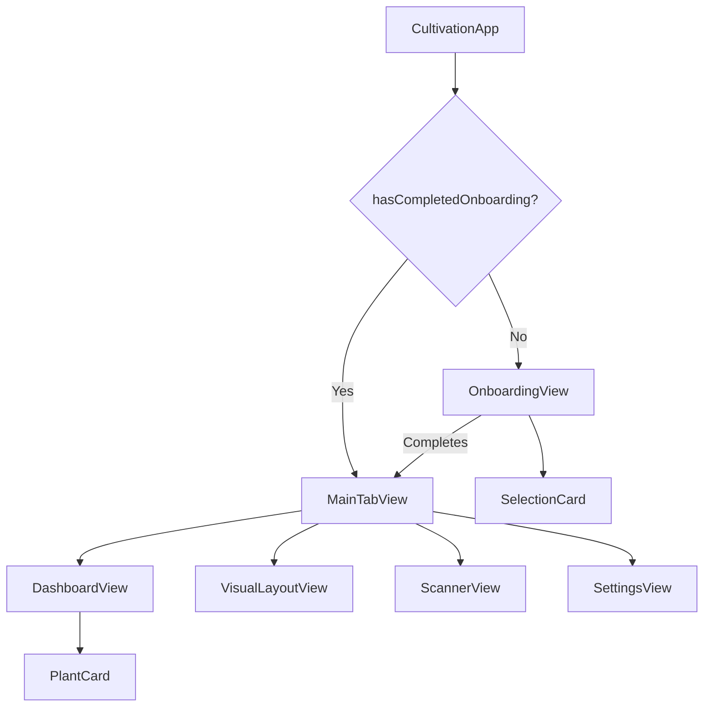

# Architecture

## Application Flow



## State Ownership

| State | Owner | Persistence |
|-------|-------|-------------|
| Onboarding complete | `ContentView` via `@AppStorage` | UserDefaults |
| Experience level / garden type | `OnboardingView` | In-memory (not yet persisted) |
| Pet-safe mode | `SettingsView` via `@State` | In-memory (not yet persisted) |
| Plant list | `DashboardView` | Hardcoded (no data layer yet) |

## Current Stub / Mock Status

- **Weather card** — hardcoded to Daphne AL / Zone 8b; no API connected
- **Plant data** — hardcoded array in `DashboardView`; no persistence
- **Scanner** — UI shell only; no `AVFoundation` capture or plant-ID API
- **Services/** — empty directory; reserved for networking and persistence layers

## Planned Services (not yet implemented)

```
Services/
├── WeatherService.swift     # Fetch weather + hardiness zone
├── PlantService.swift       # CRUD for plant list (SwiftData / CloudKit)
├── ScannerService.swift     # AVFoundation capture + plant-ID API client
└── Logger.swift             # ✅ OSLog wrapper (implemented)
```

## External Dependencies

None currently. Future integrations planned:

| Service | Purpose |
|---------|---------|
| Weather API (TBD) | Real-time weather + watering pause logic |
| Plant ID API (TBD) | Camera-based plant identification |
| CloudKit | iCloud sync for plant data |
